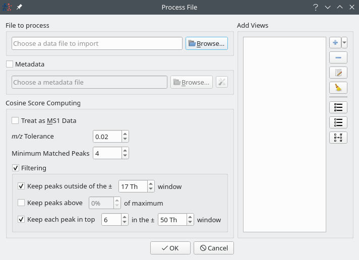
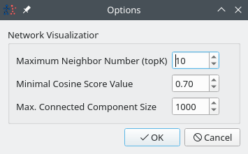
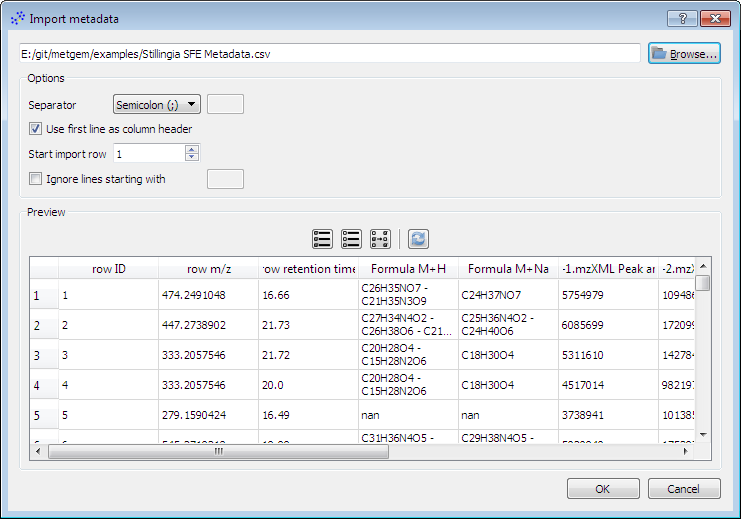

.. |add-view| image:: images/icons/list-add.svg

Import data
===========

.. _import_data:

Data
****

Networks can be created from a data file (in mgf_ or msp_ format) using the |import-data| :guilabel:`Import Data` icon. This will open the following dialog:

This dialog lets you open a data file and, optionally, a metadata table (csv_ file) using the |browse| buttons. Separator for the csv_ file should be auto-detected but you can change this parameter directly in this dialog and more parameters are available via the |options| button. See :ref:`import_metadata`}.

Parameters used by |appname| for the cosine computations step can be tuned  in the :guilabel:`Cosine Score Computing` section. See :ref:`parameters_cosine`.

In the :guilabel:`Add Views` section, you can optionally add visualisations like :ref:`Molecular Network <classical_network>` or :ref:`2-D projections <2d_projections>`. See :ref:`add_views`.

When you have loaded an data file and you are satisfied with the parameters, you can click |ok| to start the process.

.. _add_views:

Add visualisations
~~~~~~~~~~~~~~~~~~

|appname| offers two types of views that you can add to your project. See :ref:`network_views`.

To add a view, use the dropdown menu next to the |add-view| button. Choose the desired visualisation and a dialog will open to let you set a few parameters. See :ref:`parameters` for for more informations about the parameters.

    
.. _import_metadata:

Metadata
********

You can associate metadata to the spectra loaded during :ref:`import_data` :guilabel:`Import data` step. You can load these metadata from a csv_ or from a spreadsheet_ file (like LibreOffice_ Calc or `Microsoft Excel`_) or want to load new metadata, you can do so using the |import-metadata| tool button from the :ref:`File Toolbar <toolbars>`.
The following dialog will pop-up:

Metadata file (csv_) can be selected using the |browse| button. Separator for csv_ file should be auto-detected but can this be changed in the *Options* section. More parameters like whether the file contains headers or not can be also be tuned in this section.

You can see the first 100 lines that will be imported in the *Preview* section. You can select which column to import by clicking on the corresponding headers or via the upper toolbar. If no column is selected, all columns will be imported.

The |refresh| button can be used to reload file from disk using the parameters defined in the *Options* section.

.. _import_group_mappings:

Group Mappings
**************

Group mappings file can be used to group columns and sum values they contains. You can load such a file via the |import-mapping| tool button.

Group mapping files are simple text files that should follow the following scheme:

.. code-block:: none

    GROUP_group1=filename1.mzXML
    GROUP_group2=filename2.mzXML;filename3.mzXML

The example below can be translated as

.. pull-quote::

    Create a group named *group1* containing columns *filename1.mzXML* and a group *group1* containing columns *filename2.mzXML* and *filename3.mzXML*

If a column does not exists, it is simply ignored. Groups can be empty. Group columns are identified with the |import-mapping| icon.
