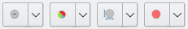
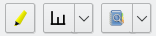
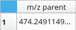
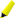
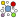

.. |sep| image:: images/toolbar-separator.png

  

  
.. |tb-nodes-tools| image:: images/toolbar-metadata-nodes-tools.png
  :alt: Tools Section of Nodes Table Toolbar
  

  
.. |node-label| image:: images/icons/node-label.svg

.. |node-color| image:: images/icons/node-color.svg
  

.. |highlight-red| image:: images/icons/highlight-red.svg

.. |formula| image:: images/icons/calculator.svg

.. |remove| image:: images/icons/list-remove.svg

.. _metadata_tables:

Metadata Tables
===============

Nodes and edges tables will contains metadata. When nodes or edges are selected in a :ref:`Network View <network_views>`, only those nodes/edges will appear in the corresponding tables. Filtering can also be performed using the :ref:`search toolbar <toolbars>`.

These tables can be hidden/shown using the :menuselection:`View --> Toolbars` menu. They can also be moved to a different position in the main window or even detached from the latter by simply dragging it to the new position or double-clicking on it's title bar.

.. image:: images/view-data-menu.png
  :alt: Data menu
  
.. note:: Columns can be selected via the |mouseright| right mouse button while the |mouseleft| left mouse button is used to change ordering.
    
    |reset-ordering|
    
    Default ordering can be reset by |mouseright| right clicking in the empty region on the upper left of the table (left side of the first column and above first line). 
  
  
.. _metadata_nodes:
  
Nodes
*****

The nodes table list all nodes and their associated metadata. There is a line per node and a column per metadata type.

The first column of this table is always :guilabel:`m/z parent` and contains *m/z* ratios of ions loaded from the :ref:`import data dialog <import_data>`.

The second one is reserved to :guilabel:`Database search results`. This column will contain a list of standards found in the databases (See :ref:`Databases Query <query_databases>`). It is hidden by default and will be visible only if there is at least one results to show.

.. _nodes_toolbar:

Nodes Toolbar
~~~~~~~~~~~~~

|tb-nodes-mapping| |sep| |tb-nodes-nodes| |sep| |tb-nodes-tools|

The toolbar located on top of the nodes table is divided in three sections.

.. _nodes_toolbar_mapping:

Mapping section
---------------

|tb-nodes-mapping|

The first section is dedicated to change how nodes are representated in :ref:`views <network_views>`. Just select one or more metadata column(s), with a |mouseright| right click, then use one these buttons. The dropdown menu include a menu item to undo these changes.

    - |node-label| Use data from the selected column as labels for nodes in the :ref:`views <network_views>`.
    - |node-pie| Represents the data in the selected columns in the form of pie charts on the nodes.
    - |node-size| Adjusts each node size based on the data from the selected column.
    - |node-color| Defines color of the nodes from the selected column data.
    
.. _nodes_toolbar_nodes:

Nodes section
-------------

|tb-nodes-nodes|

In this second section, you can interact with nodes and their associated MS/MS spectra:

    - |highlight-yellow| Highlight in the :ref:`views <network_views>` the nodes selected in the table. You can then use the :guilabel:`Zoom to the selected region` function (see :ref:`view_toolbar`) to easily locate these nodes.
    - |spectrum| Views the MS/MS spectrum associated to the selected node (shortcut :kbd:`S`). You can also compare this spectrum to the one associated to a second node using the :guilabel:`Compare spectrum` function accessible from the dropdown menu (shortcut :kbd:`C`). See :ref:`spectrum_view`.
    - |query| You can try to find similar spectra in databases by using this function. See :ref:`databases`.
    
.. note:: Functions from this section are also accessible from a context menu that will pop up if you |mouseright| right click in a cell of the nodes table.

.. _nodes_toolbar_tools:

Tools section
-------------

|tb-nodes-tools|

The last section defines tools that will end up adding columns to the table:

    - |formula| This tool allows you to create new data columns by combining existing columns using mathematical functions. See :ref:`tools_formulae`.
    - |cluster| This one uses a clustering algorithm (HDBScan_) to find clusters in the visualisation and colorize nodes according to. See :ref:`tools_cluster`.
    - |remove| Not really a tool, but you can use it to remove unwanted columns from the table.
  
  
.. _metadata_edges:

Edges
*****

The edges table list all edges and the nodes they link. This table has meaning only for the :ref:`classical network view <classical_network>` as the other views don't use edges.

There is a line per edge and the following columns are available:

    - Source: The first node that the edge link. Source and target are arbitrarily defined and this has no special meaning since the graph is not directed.
    - Target: The second node that the edge link. Same comment than the :guilabel:`Source` column.
    - Delta MZ: Difference of *m/z* ratio between the parent ions associated to the two nodes. Sign is irrelevant.
    - Cosine: The similarity score calculated to compare the spectra associated to the two nodes. Value lies between 0 and 1, the higher it is, the closer the spectra are to each other.
    - Possible interpretation: Possible interpretation of the :guilabel:`Delta MZ` based on the exact mass.

Edges Toolbar
~~~~~~~~~~~~~

The toolbar on top the edges table offers a few functions.

  
- |highlight-yellow| Highlight in the :ref:`views <network_views>` the edges selected in the table.
- |highlight-red| Highlight in the :ref:`views <network_views>` the nodes connected by the edges selected in the table.

.. note:: These functions are also accessible from a context menu that will pop up if you |mouseright| right click in a cell of the edges table.
